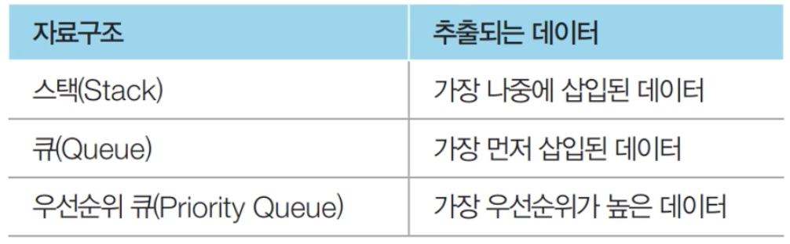
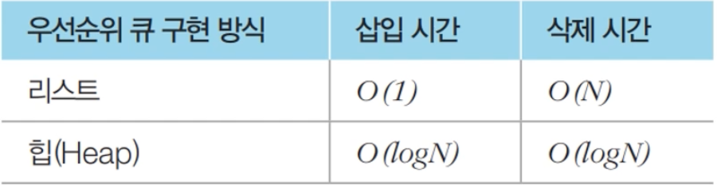
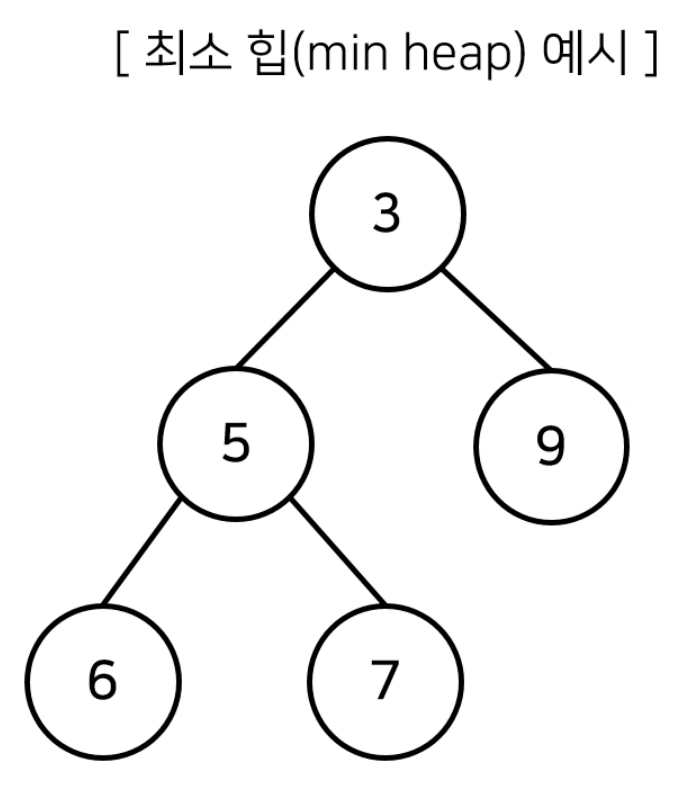
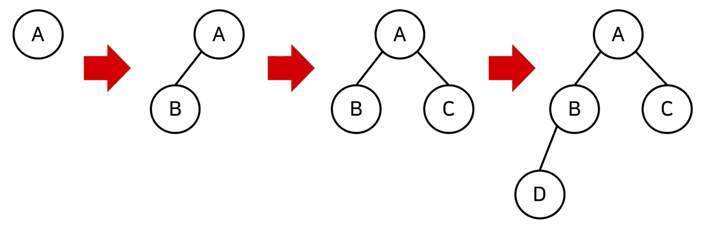
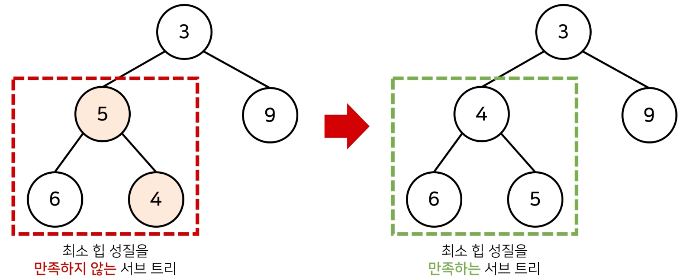
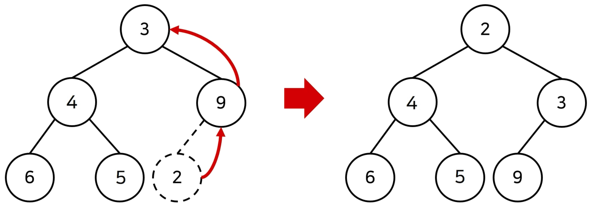
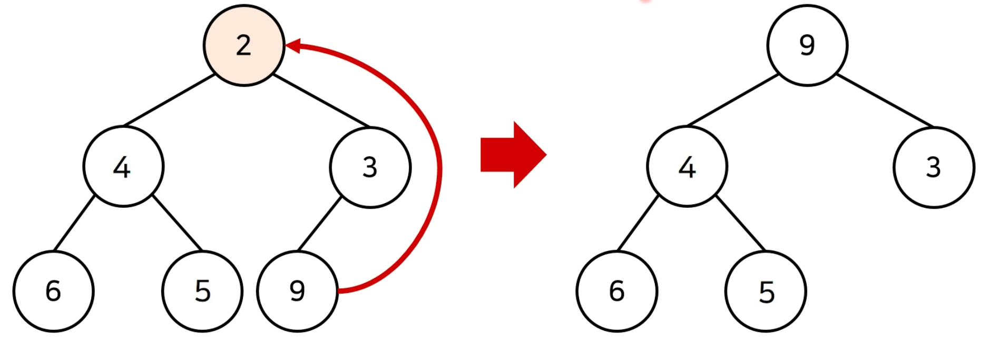

# 2장) 우선순위에 따른 자료구조

## 1. 우선순위 큐 (Priority Queue)

- 우선순위 큐는 **우선순위가 가장 높은 데이터를 가장 먼저 삭제**하는 자료구조
- 우선순위 큐는 **우선순위에 따라 처리하고 싶을 때** 사용
  - 예시) 물건 데이터를 자료구조에 넣었다가 가치가 높은 물건부터 꺼내서 확인해야 하는 경우

     
  <br><br><br><br><br><br><br>


- 우선순위 큐를 **구현하는 방법**
  - 1) **리스트**를 이용하여 구현
  - 2) **힙(heap)**을 이용하여 구현
  <br><br>


- 데이터의 개수가 `N개`일 때, 구현 방식에 따라서 시간 복잡도를 비교한 내용

    
<br><br><br><br><br>


- 단순히 N개의 데이터를 `heap`에 넣었다가 모두 꺼내는 작업은 정렬과 동일 (**힙 정렬**)
  - 이 경우 시간 복잡도 : **O(NlogN)**


### 1) 힙(heap)

- 힙(heap)의 특징

  - 힙(heap)은 **완전 이진 트리 자료구조**의 일종
  - 힙(heap)에서는 항상 **루트 노드(root node)를 제거**
  
- **최소 힙(min heap)**
  - 루트 노드 = 가장 작은 값
  - 따라서 **값이 작은 데이터**가 우선적으로 제거


      
<br><br><br><br><br><br>


- **최대 힙(max heap)**
  - 루트 노드 = 가장 큰 값
  - 따라서 **값이 큰 데이터**가 우선적으로 제거
    


### 2) 완전 이진 트리(Complete Binary Tree)

- 완전 이진 트리란 `루트(root) 노트`부터 시작하여 `왼쪽 자식 노드`, `오른쪽 자식 노드` 순서대로 데이터가 차례대로 삽입되는 트리(tree)

  
<br><br><br><br><br><br>

### 3) 최소 힙 구성 함수 : Min-Heapify()

- (**상향식**) 부모 노드로 거슬러 올라가며, 부모보다 자신의 값이 더 작은 경우에 위치 교체

  
<br><br><br><br><br><br><br>

- < 새로운 원소가 **삽입**될 때 > : O(logN)의 시간 복잡도로 힙 성질 유지

    
<br><br><br><br><br><br><br>


- < 기존 원소가 **제거**될 때 > : O(logN)의 시간 복잡도로 힙 성질 유지
   1. 가장 **마지막 노드가 루트 노드의 위치**에 오도록 함
   2. 이후 루트 노드에서부터 **하향식**으로 (더 작은 자식 노드로 ) Heapify() 진행 

      
      <br><br><br><br><br><br><br>
      
   <br><br><br><br><br><br><br><br>

### 4) 힙 정렬 구현 예제 (파이썬) (우선순위 큐 라이브러리 활용)

```python
import sys
import heapq #힙 라이브러리
input = sys.stdin.readline

def Heap_sort(iterable): #리스트/튜플 등
    h = []
    result = []

    # 모든 원소를 차례대로 힙에 삽입
    for value in iterable:
        heapq.heappush(h, value)

    # 힙에 삽입된 모든 원소를 차례대로 꺼내어 담기
    for i in range(len(h)): # 내림차순 : 꺼낼 때, - 이용
        result.append(heapq.heappop(h))

    return result

n = int(input())
arr = []

for i in range(n):
    arr.append(int(input()))

res = Heap_sort(arr)

for i in range(n):
    print(res[i]) # 오름차 순
```