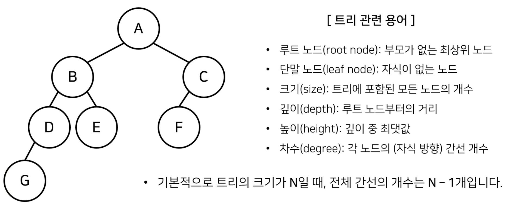
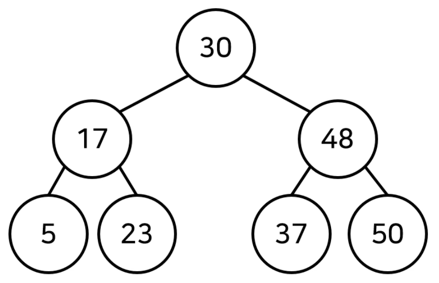
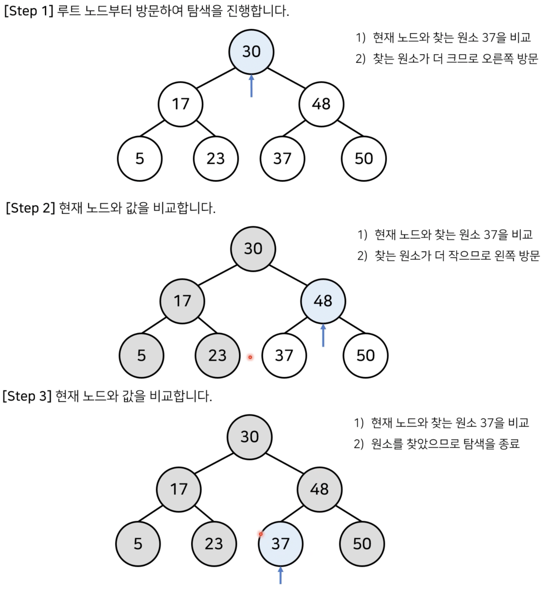
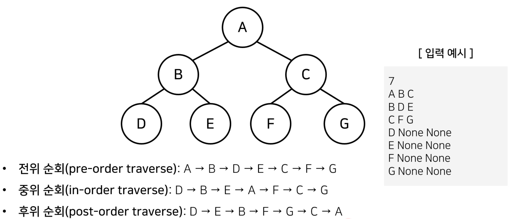

# 3장) 트리 (Tree)

## 1. 트리 (Tree)

- 트리(Tree) : `가계도`와 같은 **계층적인 구조**를 표현할 때 사용할 수 있는 자료구조


<br><br><br><br><br><br>


## 2. 이진 탐색 트리 (Binary Search Tree)

- **이진 탐색**이 동작할 수 있도록 고안된 효율적인 탐색이 가능한 자료구조


- 특징 : `왼쪽 자식 노드 < 부모 노드 < 오른쪽 자식 노드`
  - 부모 노드보다 왼쪽 자식 노드가 작음
  - 부모 노드보다 오른쪽 자식 노드가 큼


<br><br><br><br><br><br>


### - 이진 탐색 트리 데이터 조회 방법

- 이진 탐색 트리가 이미 구성되어 있다고 가정하고 데이터를 조회하는 과정을 살펴봄
- 찾고자하는 원소 : `37`

  
  <br><br><br><br><br><br>
  
  
  


## 3. 트리의 순회 (Tree Traversal)

- 트리 자료구조에 포함된 노드를 특정한 방법으로 한 번씩 방문하는 방법을 의미

  - 트리의 정보를 시각적으로 확인할 수 있음

- 대표적인 트리 순회 방법 

  -  `전위 순회` (pre-order traverse) : 루트 -> 왼쪽 자식 -> 오른쪽 자식
  -  `중위 순회` (in-order traverse) : 왼쪽 자식 -> 루트 -> 오른쪽 자식
  -  `후위 순회` (post-order traverse) : 왼쪽 자식 -> 오른쪽 자식 -> 루트

  
  
  
  
<br><br><br><br><br><br>


### - 트리의 순회 구현 예제 (파이썬)

```python
class Node:
    def __init__(self,data,left_node,right_node):
        self.data = data
        self.left_node = left_node
        self.right_node = right_node

# 전위 순회 (Pre-order Traversal)
def pre_order(node):
    print(node.data,end=' ') # 1. 뿌리
    if node.left_node != None :
        pre_order(tree[node.left_node]) # 2. 왼쪽 노드
    if node.right_node != None:
        pre_order(tree[node.right_node]) # 3. 오른쪽 노드

# 중위 순회 (In-order Traversal)
def in_order(node):
    if node.left_node != None :
        in_order(tree[node.left_node]) # 1. 왼쪽 노드
    print(node.data,end=' ') # 2. 뿌리
    if node.right_node != None:
        in_order(tree[node.right_node]) # 3. 오른쪽 노드

# 후위 순회 (Pose-order Traversal)
def post_order(node):
    if node.left_node != None:
        post_order(tree[node.left_node]) # 1. 왼쪽 노드
    if node.right_node != None:
        post_order(tree[node.right_node]) # 2. 오른쪽 노드
    print(node.data, end=' ') # 3. 뿌리

#---------------------------------------------------------------------------
n = int(input())
tree = {} # 딕셔너리 형태

for i in range(n):
    data, left_node, right_node = input().split()
    if left_node =="None":
        left_node = None
    if right_node == "None" :
        right_node = None
    tree[data] = Node(data,left_node,right_node)

pre_order(tree['A'])
print()
in_order(tree['A'])
print()
post_order(tree['A'])

# 입력 
7
A B C
B D E
C F G
D None None
E None None
F None None
G None None

# 출력
A B D E C F G 
D B E A F C G 
D E B F G C A 
```