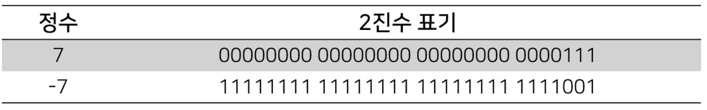
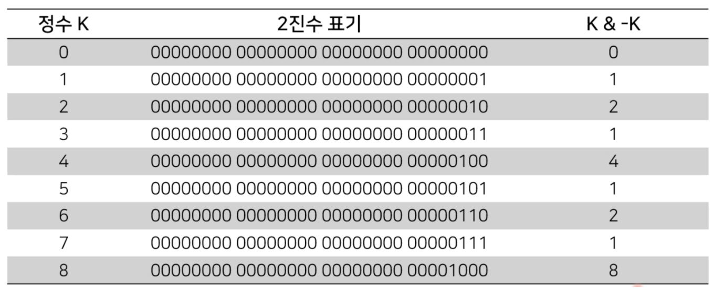
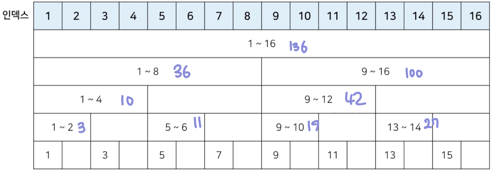
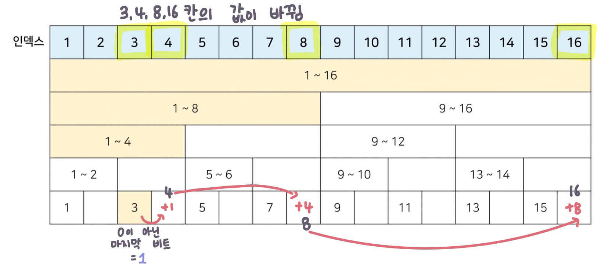
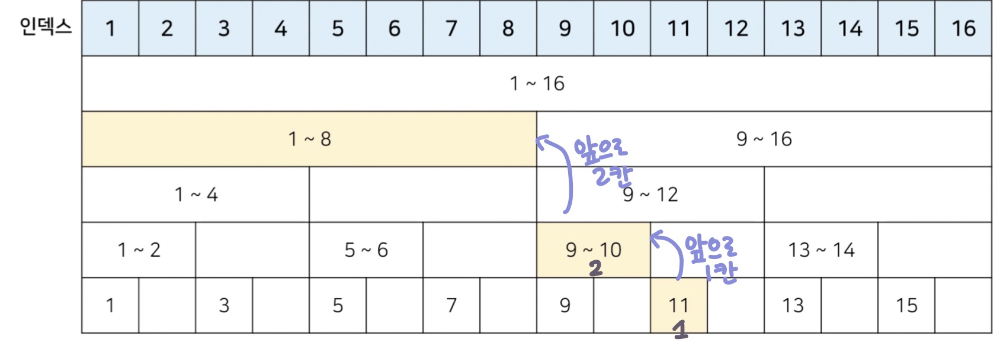

# 4장) 바이너리 인덱스 트리 (Binary Indexed Tree)

## 0. 구간 합(Interval Sum) 문제

- BOJ 데이터 업데이트가 가능한 상황에서의  '**구간 합 구하기**' 문제 : http://www.acmicpc.net/problem/2042

  ```
  어떤 N개의 수가 주어져 있다. 그런데 중간에 수의 변경이 빈번히 일어나고 그 중간에 어떤 부분의 합을 구하려 한다. 만약에 1,2,3,4,5 라는 수가 있고, 3번째 수를 6으로 바꾸고 2번째부터 5번째까지 합을 구하라고 한다면 17을 출력하면 되는 것이다. 그리고 그 상태에서 다섯 번째 수를 2로 바꾸고 3번째부터 5번째까지 합을 구하라고 한다면 12가 될 것이다.
  
  데이터 개수 : N(1 ≤ N ≤ 1,000,000)
  데이터 변경 횟수 : M(1 ≤ M ≤ 10,000)
  구한 합 계산 횟수 : K(1 ≤ K ≤ 10,000)
  ```

  

## 1. 바이너리 인덱스 트리 (펜윅 트리) (fenwick tree)

- `2진법 인덱스 구조`를 활용해 구간 합 문제를 효과적으로 해결해 줄 수 있는 자료구조
- 정수에 따른 2진수 표기 (**2의 보수법**)


<br><br><br><br><br><br>

<br><br>
- < 0이 아닌 마지막 비트를 찾는 방법 >
  - 특정한 숫자 K의 0이 아닌 마지막 비트를 찾기 위해서 K & -K를 계산하면 됨 (위의 경우 1)

- K & -K 계산 결과 예시 (표)


<br><br><br><br><br><br>

<br><br>
- K & -K 계산 결과 예시 (파이썬)

> 4_1

```python
n = 8 

for i in range(n+1) :
  print(f'{i}의 마지막 비트: {i & -i}')
  
# 결과
0의 마지막 비트: 0
1의 마지막 비트: 1
2의 마지막 비트: 2
3의 마지막 비트: 1
4의 마지막 비트: 4
5의 마지막 비트: 1
6의 마지막 비트: 2
7의 마지막 비트: 1
8의 마지막 비트: 8
```


### 1. 트리 구조 만들기

- 0이 아닌 마지막 비트 = 내가 저장하고 있는 값들의 개수


<br><br><br><br><br><br>


### 2. 값 업데이트

- 특정 값을 변경할 때 : 0이 아닌 마지막 비트만큼 더하면서 구간들의 값을 변경 (예시 = `3rd`)


<br><br><br><br><br><br>

<br><br>
### 3. 누적 합 (Prefix Sum)

- **1부터 N까지의 합(누적 합) 구하기** : 0이 아닌 마지막 비트만큼 빼면서 구간들의 값의 합 계산 (예시 = `11th`)


<br><br><br><br><br><br>

<br><br>
### 4. 바이너리 인덱스 트리 구현 (파이썬)

> 4_2

```python
import sys
input = sys.stdin.readline()

# 데이터의 개수(n), 변경 횟수(m), 구간 합 계산 횟수(k)
n, m, k = map(int,input().split())

# 전체 데이터의 개수는 최대 1,000,000개
arr = [0] * (n+1)
tree = [0] * (n+1)

# i번째 수까지의 누적합을 계산하는 함수
def prefix_sum(i):
    result = 0
    while i>0:
        result += tree[i]
        # 0이 아닌 마지막 비트만큼 빼가면서 이동
        i -= (i & -i)
    return result

# i번째 수를 바뀐 크기(dif)만큼 더하는 함수
def update(i,dif):
    while i <= n:
        tree[i] += dif
        i += (i & -i)

# start부터 end까지의 구간 합을 계산하는 함수
def interval_sum(start,end):
    return prefix_sum(end) - prefix_sum(start - 1)


for i in range(1,n+1): # 1부터 데이터의 갯수만큼
    x = int(input())
    arr[i] = x
    update(i,x)

for i in range(m+k): # 변경 횟수(m) + 구간 합 계산 횟수(k)
    a, b, c = map(int,input().split())

    # 1. 업데이트(update) 연산인 경우
    if a == 1:
        update(b,c-arr[b]) # 바뀐 크기(dif)만큼 적용
        arr[b] = c

    # 2. 구간 합(interval sum) 연산인 경우
    else :
        print(interval_sum(b,c))
        
# 입력
5 2 2
1
2
3
4
5
1 3 6
2 2 5
1 5 2
2 3 5

# 출력
17
12
```