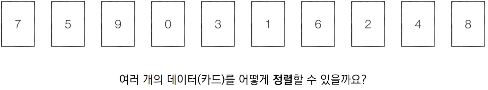
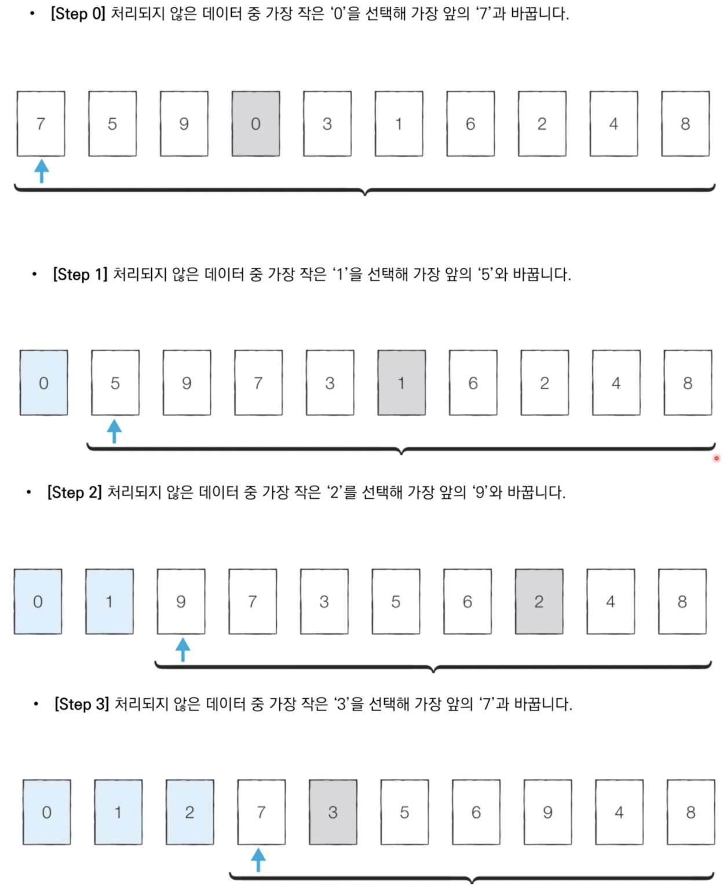
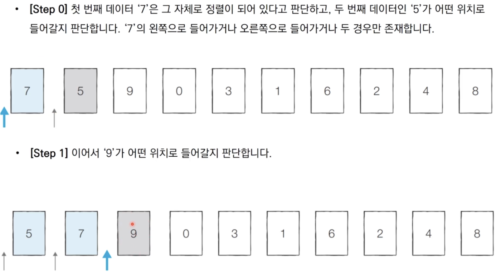

# 5장) 선택 정렬과 삽입 정렬

- **정렬** : 데이터를 특정한 기준에 따라 순서대로 나열하는 것 (일반적으로 문제 상황에 따라서 적절한 정렬 알고리즘 사용)



<br><br><br><br><br><br>


<br><br>
## 1. 선택 정렬

- 처리되지 않은 데이터 중에서 **가장 작은 데이터를 `선택`해 맨 앞에 있는 데이터와 바꾸는 것을 반복**


<br><br><br><br><br><br>

<br><br>
### 1-2. 선택 정렬 구현 (파이썬)

> 5_1

```python
array = [7,5,9,0,3,1,6,2,4,8]

for i in range(len(array)):
    min_index = i # 가장 작은 원소의 인덱스
    for j in range(i+1, len(array)):
        if array[min_index] > array[j]:
            min_index = j
    array[i],array[min_index] = array[min_index],array[i]

print(array)

# 출력
[0,1,2,3,4,5,6,7,8,9]
```


### 1-3. 선택 정렬의 시간 복잡도

- 선택 정렬의 N번 만큼 가장 작은 수를 찾아서 맨 앞으로 보내야 함

- 구현 방식에 따라서 사소한 오차는 있을 수 있지만, 전체 연산 횟수는 다음과 같음

  ```pyth
  N + (N - 1) + (N - 2) + ... + 2
  ```

- 이는 (N² + N - 2)로 표현 가능, Big O 표기법에 따라서 **O(N²)**


## 2. 삽입 정렬

- 처리되지 않은 데이터를 하나씩 골라 적절한 위치에 삽입
- 선택 정렬에 비해 구현 난이도가 높은 편이지만, 효율적으로 동작


<br><br><br><br><br><br>

<br><br>


### 2-1. 삽입 정렬 구현 (파이썬)

> 5_2

```python
array = [7,5,9,0,3,1,6,2,4,8]

for i in range(1,len(array)):
    for j in range(i, 0, -1):
        if array[j] < array[j-1]: # 왼쪽 칸이 작으면 왼쪽으로 한 칸 이동
            array[j],array[j-1] = array[j-1],array[j]
        else :
            break

print(array)
```


### 2-2. 삽입 정렬 시간 복잡도

- **O(N²)**, 선택 정렬과 마찬가지로 반복문이 두 번 중첩되어 사용
- 삽입 정렬의 현재 **리스트의 데이터가 거의 정렬되어 있는 상태**라면 매우 빠르게 동작
  - 최선의 경우 **O(N)**
  - 이미 정렬되어 있는 상태에서 다시 삽입 정렬을 수행할 시 **O(N)**