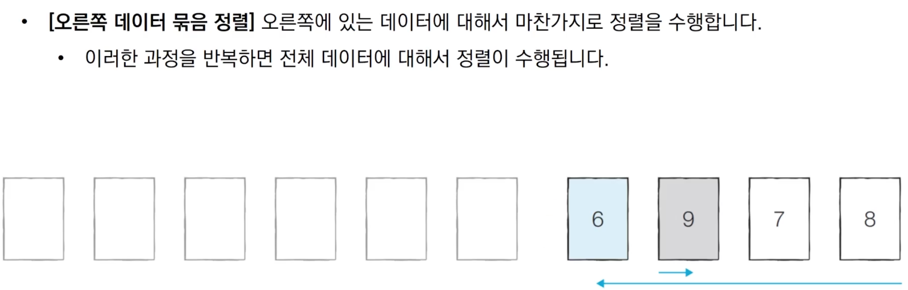
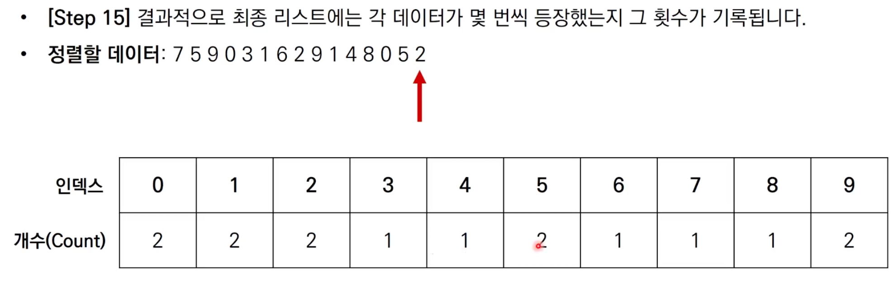

# -------------------------------------------------------------------

# 6장) 퀵 정렬과 계수 정렬

## 1. 퀵 정렬

- 기준 데이터를 설정하고 그 **기준보다 큰 데이터와 작은 데이터의 위치를 바꾸는 방법**
- 일반적인 상황에서 가장 많이 사용되는 정렬 알고리즘 중 하나
- 병합 정렬과 더불어 대부분의 프로그래밍 언어의 정렬 라이브러리의 근간이 되는 알고리즘
- `가장 기본적인 퀵 정렬` : **첫번째 데이터를 기준 데이터(Pivot)로 설정**


### 1-1. 퀵 정렬 동작 예시


<br><br><br><br><br><br>


<br><br><br><br><br><br>


<br><br><br><br><br><br>


<br><br><br><br><br><br>


<br><br><br><br><br><br>


<br><br><br><br><br><br>


### 1-2. 퀵 정렬이 빠른 이유 (직관적인 이해)


<br><br><br><br><br><br>

<br><br>
### 1-3. 퀵 정렬의 시간 복잡도

- `평균의 경우`  : **O(NlogN)**
- `최악의 경우` :  **O(N²)** (이미 정렬된 배열)


### 1-4. 퀵 정렬 구현 (파이썬)

> 6_1

```python
array = [5,7,9,0,3,1,6,2,4,8]

def quick_sort(array,start,end):
    if start >= end: # 원소가 1개인 경우 종료
        return
    pivot = start # 첫번째 원소를 피벗으로
    left = start+1
    right = end
    # print(f'pivot: {array[pivot]} min: {array[left]}, max:{array[right]}, {array}')

    while left <= right:
        # 피벗보다 큰 데이터를 찾을 때까지 반복
        while left < end and array[left] < array[pivot] :
            left += 1

        # 피벗보다 작은 데이터를 찾을 때까지 반복
        while right > start and array[right] > array[pivot]:
            right -= 1

        if left >= right: # 엇갈렸다면 작은 데이터와 피벗을 교체
            array[right],array[pivot] = array[pivot],array[right]

        else : # 엇갈리지 않았다면 작은 데이터와 큰 데이터를 교체
            array[right],array[left] = array[left],array[right]

        # 분할 이후 왼쪽 부분과 오른쪽 부분에서 각각 정렬 수행
        quick_sort(array,start,right-1)
        quick_sort(array,right+1,end)


quick_sort(array,0,len(array)-1)
print(array)

# 결과
[0,1,2,3,4,5,6,7,8,9]
```


### 1-5. 퀵 정렬 구현 (파이썬의 장점을 살린 방식)

> 6_2

```python
array = [5,7,9,0,3,1,6,2,4,8]

def quick_sort(array) :
    # 리스트가 하나 이하의 원소만을 담고 있다면 종료
    if len(array) <= 1:
        return array
    pivot = array[0]
    tail = array[1:]

    left_side = [x for x in tail if x <= pivot] # 분할된 왼쪽 부분
    right_side = [x for x in tail if x > pivot] # 분할된 오른쪽 부분

    # 분할 이후 왼쪽 부분과 오른쪽 부분에서 각각 정렬 수행하고, 전체 리스트 반환
    return quick_sort(left_side) + [pivot] +quick_sort(right_side)

print(quick_sort(array))
```


## 2. 계수 정렬

- 특정한 조건이 부합할 때만 사용할 수 있지만 **매우 빠르게 동작**하는 정렬 알고리즘
  - 계수 정렬은 **데이터의 크기 범위가 제한되어 정수 형태로 표현할 수 있을 때** 사용 가능
- 데이터의 개수가 N, 데이터(양수) 중 최댓값이 K일 때 최악의 경우에도 수행 시간 **O(N + K)**를 보장


### 2-1. 계수 정렬 동작 예시


<br><br><br><br><br><br>


<br><br><br><br><br><br>


<br><br><br><br><br><br>


<br><br><br><br><br><br>


<br><br><br><br><br><br>


<br><br><br><br><br><br>


### 2-2. 계수 정렬 구현 (파이썬)

```python
# 모든 원소의 값이 0보다 크거나 같다고 가정
array = [7,5,9,0,3,1,6,2,9,1,4,8,0,5,2]
# 모든 범위를 포함하는 리스트 선언(모든 값은 0으로 초기화)
count = [0] * (max(array) + 1)

for i in range(len(array)):
    count[array[i]] += 1 # 각 데이터에 해당하는 인덱스의 값 증가

for i in range(len(count)): # 리스트에 기록된 정렬 정보 확인
    for j in range(count[i]):
        print(i,end=' ') # 띄어쓰기를 구분으로 등장한 횟수만큼 인덱스 출력
        
# 출력
0 0 1 1 2 2 3 4 5 5 6 7 8 9 9
```


###  2-3. 계수 정렬 시간 복잡도

- 시간/공간 복잡도 모두 **O(N + K)**
- 때에 따라서 심각한 비효율성 초래 가능
  - 데이터가 0과 999,999로 단 2개만 존재하는 경우
- 계수 정렬은 **동일한 값을 가지는 데이터가 여러 개 등장할 때** 효과적으로 사용할 수 있습니다.
  - 성적의 경우 100점을 맞은 학생이 여러 명일 수 있기 때문에 계수 정렬이 효과적