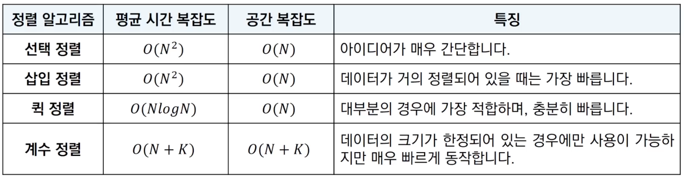
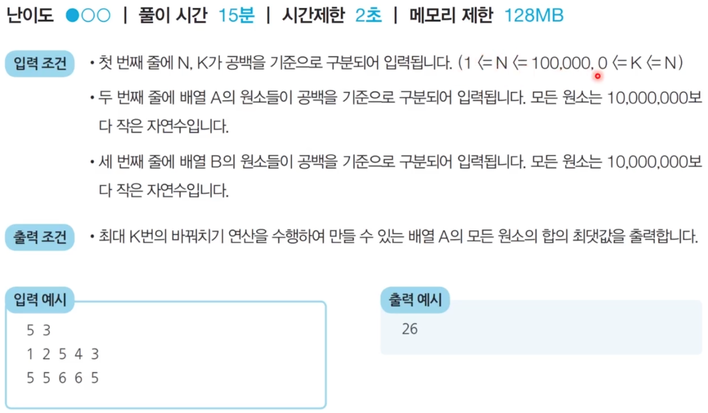

# 7장) 정렬 알고리즘 비교

- 앞서 다룬 네 가지 정렬 알고리즘 비교
- 대부분의 프로그래밍 언어에서 지원하는 표준 정렬 라이브러리는 최악의 경우에도 O(NlogN)을 보장하도록 설계되어있음


<br><br><br><br><br><br>


<br><br><br>
## 1. 선택 정렬과 기본 정렬 라이브러리 수행 시간 비교 구현 (파이썬)

> 7_1

```python
from random import randint
import time

# 배열에 10,000개의 정수를 삽입
array = []
for _ in range(10000):
    # 1부터 100 사이의 랜덤한 정수
    array.append(randint(1,100))

# 선택 정렬 프로그램 성능 측정
start_time = time.time()

# 선택 정렬 프로그램 소스코드
for i in range(len(array)):
    min_index = i # 가장 작은 원소의 인덱스
    for j in range( i+1, len(array)):
        if array[min_index] > array[j]:
            min_index = j
        array[i],array[min_index] = array[min_index],array[i]

# 측정 종료
end_time = time.time()
# 수행 시간 출력
print(f'선택 정렬 성능 측정 : {end_time -  start_time}')

# 배열을 다시 무작위 데이터로 초기화
array = []
for _ in range(10000):
    # 1부터 100 사이의 랜덤한 정수
    array.append(randint(1,100))

# 기본 정렬 프로그램 성능 측정
start_time = time.time()

# 기본 정렬 라이브러리 사용
array.sort()

# 측정 종료
end_time = time.time()
# 수행 시간 출력
print(f'기본 정렬 성능 측정 : {end_time -  start_time}')
```


<br><br>
## 2. 문제 : 두 배열의 원소 교체 

### 1) 문제 설명

  - 동빈이는 두 개의 배열 A와 B를 가지고 있습니다. 두 배열은 N개의 원소로 구성되어 있으며, 배열의 원소는 모두 자연수입니다.

  - 동빈이는 **최대 K번의 바꿔치기 연산**을 수행할 수 있는데, 
  
     바꿔치기 연산이란 배열 A에 있는 원소 하나와 배열 B에 있는 원소 하나를 골라서 두 원소를 서로 바꾸는 것을 말합니다.
    
  - 동빈이의 최종 목표는 배열 A에 있는 모든 원소의 합이 최대가 되도록 하는 것이며, 여러분이는 동빈이를 도와야 합니다
  
  - N,K 그리고 배열 A와 B의 정보가 주어졌을때,  최대 K번의 바꿔치기 연산을 수행하여 만들 수 있는
  
     **배열 A의 모든 원소의 합의 최댓값을 출력**하는 프로그램을 작성하세요.

  

  - 예를 들어 N= 5, K= 3이고, 배열 A와 B가 다음과 같다고 해볼 때
    - 배열 A = [1,2,5,4,3]
    - 배열 B = [5,5,6,6,5]
  - 이 경우, 다음과 같이 세 번의 연산을 수행할 수 있습니다.
    - 연산 1) 배열 A의 원소 '1'과 배열 B의 원소 '6'을 바꾸기
    - 연산 2) 배열 A의 원소 '2'과 배열 B의 원소 '6'을 바꾸기
    - 연산 3) 배열 A의 원소 '3'과 배열 B의 원소 '5'을 바꾸기
  - 세 번의 연산 이후 배열 A와 배열 B의 상태는 다음과 같이 구성될 것입니다.
    - 배열 A = [6,6,5,4,5]
    - 배열 B = [3,5,1,2,5]
  - 이때 배열 A의 모든 원소의 합은 26이 되며, 이보다 더 합을 크게 만들 수는 없습니다.


<br><br>
### 2) 문제 조건


<br><br><br><br><br><br><br><br><br>

<br><br><br><br><br><br>
### 3) 문제 해결 아이디어

- 핵심 아이디어 : 매번 배열 A에서 가장 작은 원소를 골라서, 배열 B에서 가장 큰 원소와 교체
- 가장 먼저 배열 A와 B가 주어지면 A에 대하여 오름차순 정렬하고, B에 대하여 내림차순 정렬합니다
- 이후에 두 배열의 원소를 첫 번째 인덱스부터 차례로 확인하면서 A의 원소가 B의 원소보다 작을 때에만 교체를 수행
- 최악의 경우 O(NlogN)을 보장하는 정렬 알고리즘을 이용해야 합니다.


<br><br>
### 4) 구현 (파이썬)

> 7_2

```python
n,k = map(int, input().split())
a = list(map(int,input().split()))
b = list(map(int,input().split()))

a.sort() # 배열 A는 오름차순 정렬 수행
b.sort(reverse=True) # 배열 B는 내림차순 정렬 수행

# 첫 번째 인덱스부터 확인하며, 두 배열의 원소를 최대 k번 비교
for i in range(k):
    # A의 원소가 B의 원소보다 작은 경우
    if a[i] < b[i] :
        # 두 원소를 교체
        a[i],b[i] = b[i],a[i]
    else : # A의 원소가 B의 원소보다 크거나 같을 때, 반복문을 탈출
        break

print(sum(a))
```