# 1장) 스택과 큐

## 1. 스택 (Stack)

- 먼저 들어온 데이터가 나중에 나가는 형식의 자료구조 (**선입후출**)
- **입구와 출구가 동일한 형태**로 스택을 시각화 할 수 있음

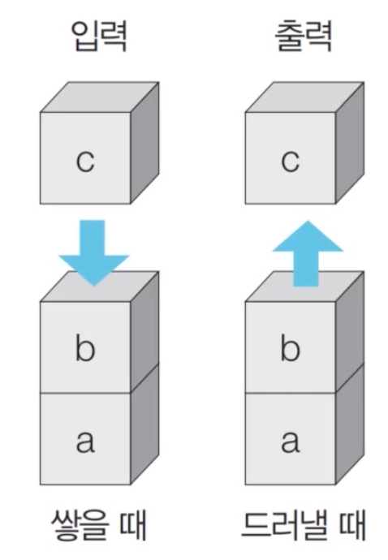

### 1) 스택 동작 예시

- **삽입(5)** - **삽입(2)** - **삽입(3)** - **삽입(7)** - 삭제() - 삽입(1) - 삽입(4) - 삭제()

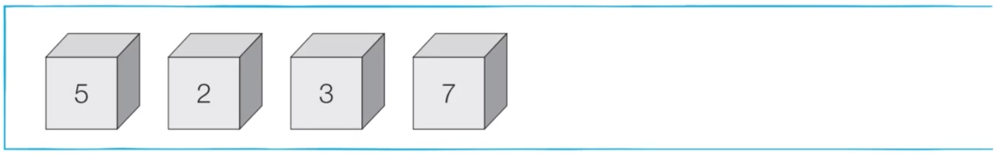

- **삽입(5)** - **삽입(2)** - **삽입(3)** - **삽입(7)** - **삭제()** - 삽입(1) - 삽입(4) - 삭제()

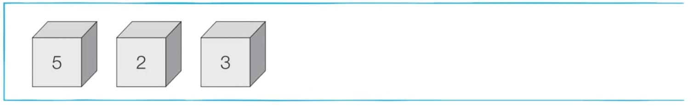

- **삽입(5)** - **삽입(2)** - **삽입(3)** - **삽입(7)** - **삭제()** - **삽입(1)** - **삽입(4)** - 삭제()

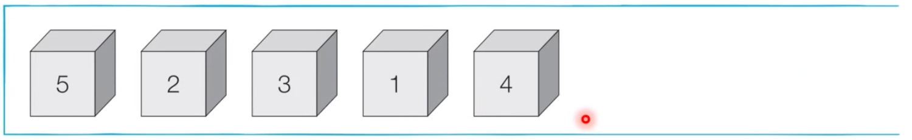

- **삽입(5)** - **삽입(2)** - **삽입(3)** - **삽입(7)** - **삭제()** - **삽입(1)** - **삽입(4)** - **삭제()**

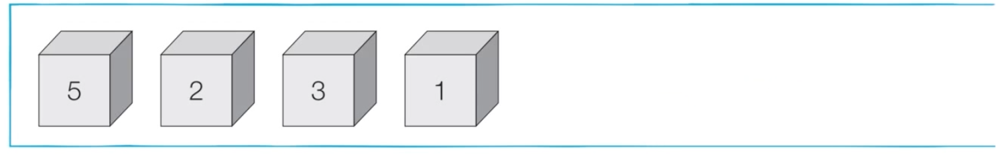


### 2) 스택 동작 구현 (파이썬) 

> 1_1

```python
stack = []

# 삽입(5) - 삽입(2) - 삽입(3) - 삽입(7) - 삭제() - 삽입(1) - 삽입(4) - 삭제()
stack.append(5)
stack.append(2)
stack.append(3)
stack.append(7)
stack.pop()
stack.append(1)
stack.append(4)
stack.pop()

print(stack[::-1]) # 최상단 원소부터 출력
print(stack) #최하단 원소부터 출력
# 시간복잡도 : O(1)
```


## 2. 큐 (Queue)

- 먼저 들어온 데이터가 먼저 나가는 형식의 자료구조 (**선입선출**)
- 큐는 **입구와 출구가 모두 뚫려 있는 터널**과 같은 형태로 시각화 할 수 있음

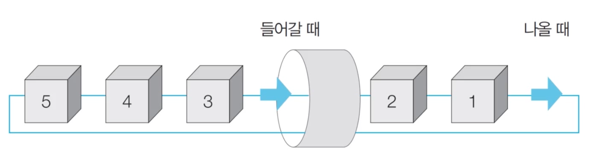


### 1) 큐 동작 예시

- **삽입(5)** - **삽입(2)** - **삽입(3)** - **삽입(7)** - 삭제() - 삽입(1) - 삽입(4) - 삭제()


- **삽입(5)** - **삽입(2)** - **삽입(3)** - **삽입(7)** - **삭제()** - 삽입(1) - 삽입(4) - 삭제()


- **삽입(5)** - **삽입(2)** - **삽입(3)** - **삽입(7)** - **삭제()** - **삽입(1)** - **삽입(4)** - 삭제()


- **삽입(5)** - **삽입(2)** - **삽입(3)** - **삽입(7)** - **삭제()** - **삽입(1)** - **삽입(4)** - **삭제()**


### 2) 큐 동작 구현 (파이썬)

> 1_2

```python
# 큐 (Queue) 구현을 위해 deque 라이브러리 사용
from collections import deque

queue = deque()

# 삽입(5) - 삽입(2) - 삽입(3) - 삽입(7) - 삭제() - 삽입(1) - 삽입(4) - 삭제()
queue.append(5)
queue.append(2)
queue.append(3)
queue.append(7)
queue.popleft()
queue.append(1)
queue.append(4)
queue.popleft()

print(queue) # 먼저 들어온 순서대로 출력
queue.reverse() # 역순으로 바꾸기
print(queue) # 나중에 들어온 순서대로 출력
```

# -------------------------------------------------------------------


# 2장) 우선순위에 따른 자료구조

## 1. 우선순위 큐 (Priority Queue)

- 우선순위 큐는 **우선순위가 가장 높은 데이터를 가장 먼저 삭제**하는 자료구조
- 우선순위 큐는 **우선순위에 따라 처리하고 싶을 때** 사용
  - 예시) 물건 데이터를 자료구조에 넣었다가 가치가 높은 물건부터 꺼내서 확인해야 하는 경우

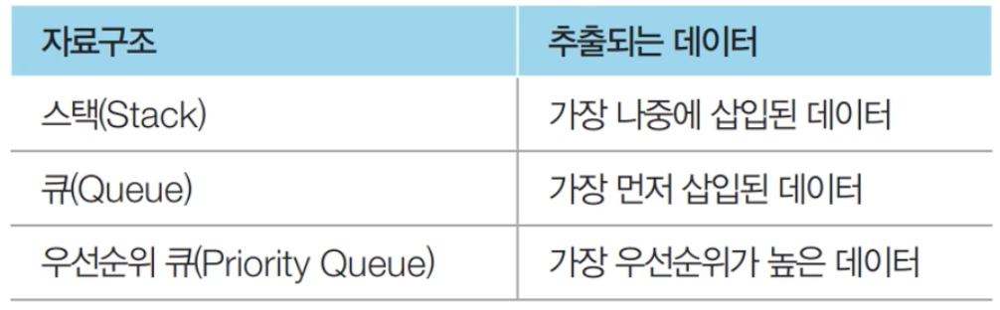


- 우선순위 큐를 **구현하는 방법**
  - 1) **리스트**를 이용하여 구현
  - 2) **힙(heap)**을 이용하여 구현


- 데이터의 개수가 `N개`일 때, 구현 방식에 따라서 시간 복잡도를 비교한 내용

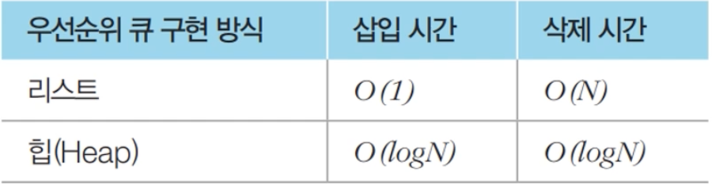


- 단순히 N개의 데이터를 `heap`에 넣었다가 모두 꺼내는 작업은 정렬과 동일 (**힙 정렬**)
  - 이 경우 시간 복잡도 : **O(NlogN)**


### 1) 힙(heap)

- 힙(heap)의 특징

  - 힙(heap)은 **완전 이진 트리 자료구조**의 일종
  - 힙(heap)에서는 항상 **루트 노드(root node)를 제거**
  - **최소 힙(min heap)**
    - 루트 노드 = 가장 작은 값
    - 따라서 **값이 작은 데이터**가 우선적으로 제거

      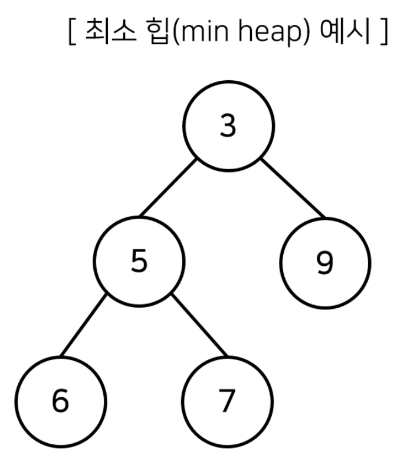

  

  

  - **최대 힙(max heap)**
    - 루트 노드 = 가장 큰 값
    - 따라서 **값이 큰 데이터**가 우선적으로 제거
      


### 2) 완전 이진 트리(Complete Binary Tree)

- 완전 이진 트리란 `루트(root) 노트`부터 시작하여 `왼쪽 자식 노드`, `오른쪽 자식 노드` 순서대로 데이터가 차례대로 삽입되는 트리(tree)

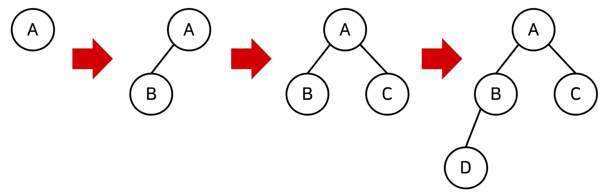

### 3) 최소 힙 구성 함수 : Min-Heapify()

- (**상향식**) 부모 노드로 거슬러 올라가며, 부모보다 자신의 값이 더 작은 경우에 위치 교체

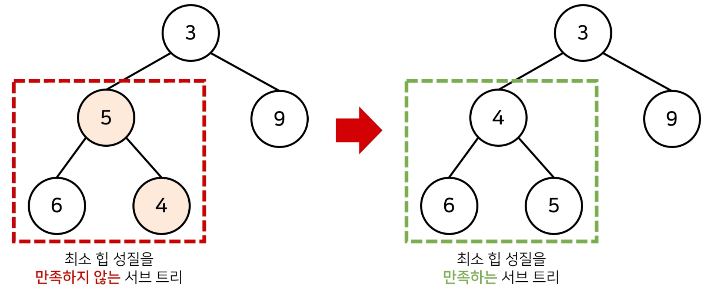

- 새로운 원소가 **삽입**될 때

  - **O(logN)**의 시간 복잡도로 힙 성질 유지

  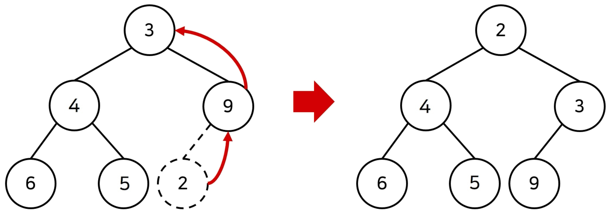


- 기존 원소가 **제거**될 때

  - **O(logN)**의 시간 복잡도로 힙 성질 유지
    - 1 . 가장 **마지막 노드가 루트 노드의 위치**에 오도록 함

    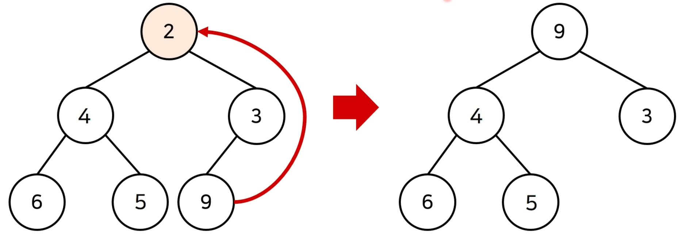

    
    
    - 2. 이후 루트 노드에서부터 **하향식**으로 (더 작은 자식 노드로 ) Heapify() 진행
    
    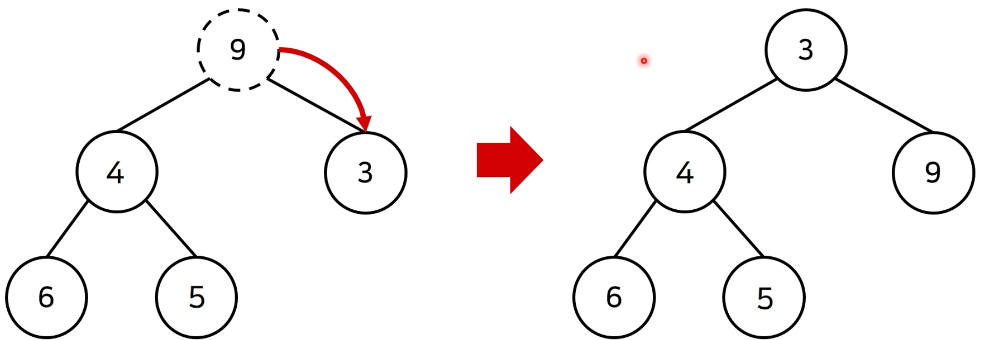


### 4) 힙 정렬 구현 예제 (파이썬) (우선순위 큐 라이브러리 활용)

```python
import sys
import heapq #힙 라이브러리
input = sys.stdin.readline

def Heap_sort(iterable): #리스트/튜플 등
    h = []
    result = []

    # 모든 원소를 차례대로 힙에 삽입
    for value in iterable:
        heapq.heappush(h, value)

    # 힙에 삽입된 모든 원소를 차례대로 꺼내어 담기
    for i in range(len(h)): # 내림차순 : 꺼낼 때, - 이용
        result.append(heapq.heappop(h))

    return result

n = int(input())
arr = []

for i in range(n):
    arr.append(int(input()))

res = Heap_sort(arr)

for i in range(n):
    print(res[i]) # 오름차 순
```


# -------------------------------------------------------------------

# 3장) 트리 (Tree)

## 1. 트리 (Tree)

- 트리(Tree) : `가계도`와 같은 **계층적인 구조**를 표현할 때 사용할 수 있는 자료구조

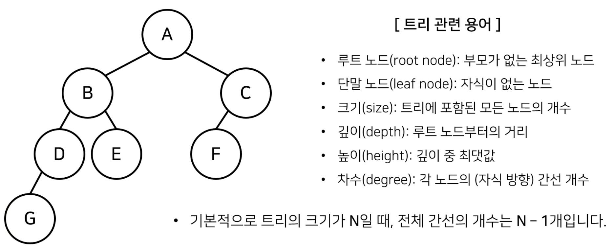


## 2. 이진 탐색 트리 (Binary Search Tree)

- **이진 탐색**이 동작할 수 있도록 고안된 효율적인 탐색이 가능한 자료구조


- 특징 : `왼쪽 자식 노드 < 부모 노드 < 오른쪽 자식 노드`
  - 부모 노드보다 왼쪽 자식 노드가 작음
  - 부모 노드보다 오른쪽 자식 노드가 큼

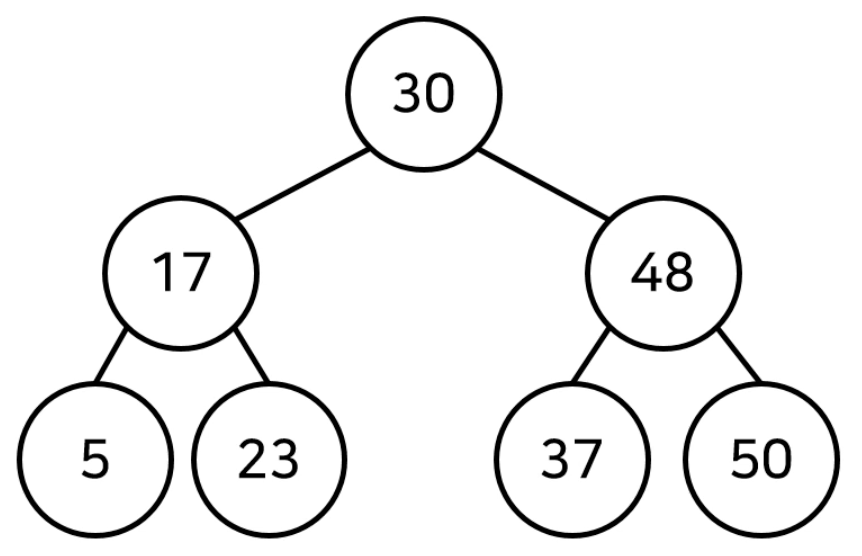


### - 이진 탐색 트리 데이터 조회 방법

- 이진 탐색 트리가 이미 구성되어 있다고 가정하고 데이터를 조회하는 과정을 살펴봄
- 찾고자하는 원소 : `37`

  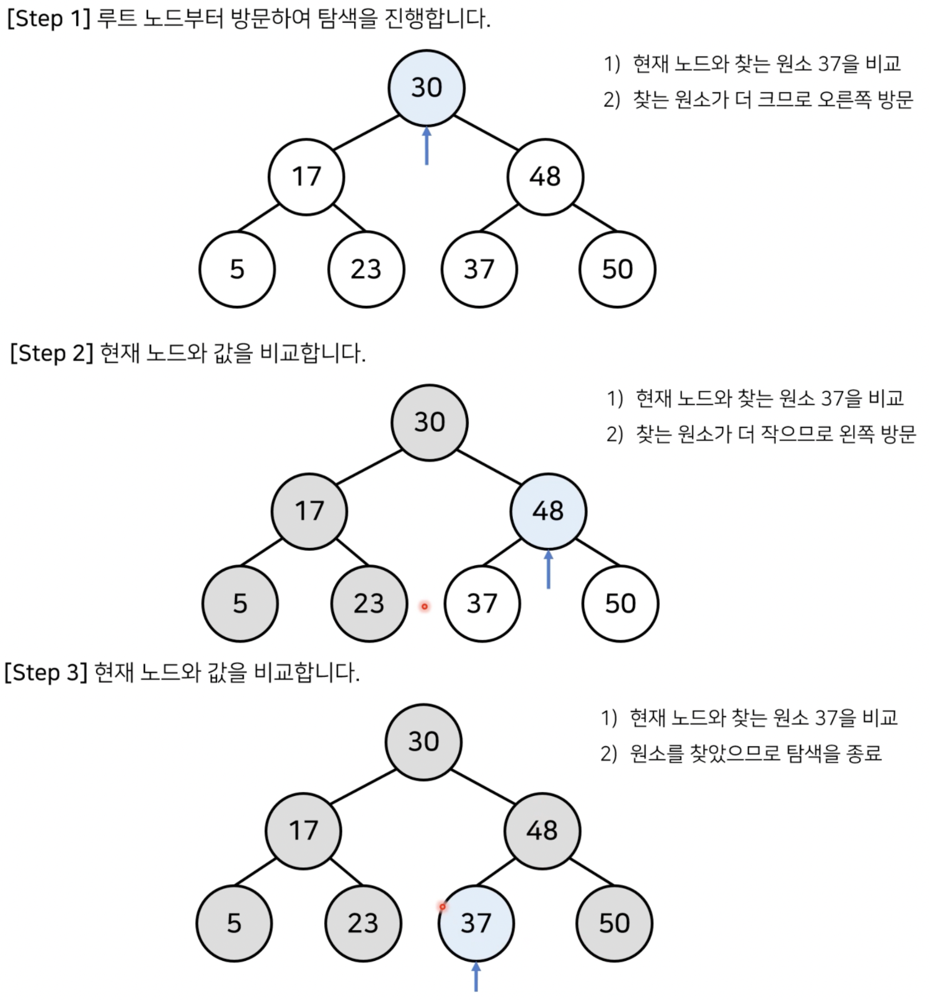
  
  


## 3. 트리의 순회 (Tree Traversal)

- 트리 자료구조에 포함된 노드를 특정한 방법으로 한 번씩 방문하는 방법을 의미

  - 트리의 정보를 시각적으로 확인할 수 있음

- 대표적인 트리 순회 방법 

  -  `전위 순회` (pre-order traverse) : 루트 -> 왼쪽 자식 -> 오른쪽 자식
  -  `중위 순회` (in-order traverse) : 왼쪽 자식 -> 루트 -> 오른쪽 자식
  -  `후위 순회` (post-order traverse) : 왼쪽 자식 -> 오른쪽 자식 -> 루트

  
  
  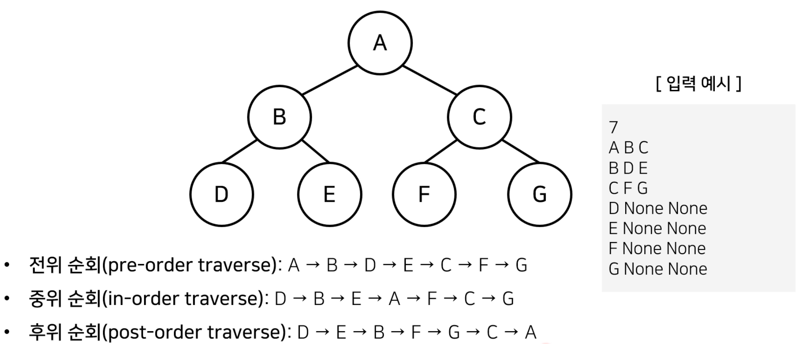


### - 트리의 순회 구현 예제 (파이썬)

```python
class Node:
    def __init__(self,data,left_node,right_node):
        self.data = data
        self.left_node = left_node
        self.right_node = right_node

# 전위 순회 (Pre-order Traversal)
def pre_order(node):
    print(node.data,end=' ') # 1. 뿌리
    if node.left_node != None :
        pre_order(tree[node.left_node]) # 2. 왼쪽 노드
    if node.right_node != None:
        pre_order(tree[node.right_node]) # 3. 오른쪽 노드

# 중위 순회 (In-order Traversal)
def in_order(node):
    if node.left_node != None :
        in_order(tree[node.left_node]) # 1. 왼쪽 노드
    print(node.data,end=' ') # 2. 뿌리
    if node.right_node != None:
        in_order(tree[node.right_node]) # 3. 오른쪽 노드

# 후위 순회 (Pose-order Traversal)
def post_order(node):
    if node.left_node != None:
        post_order(tree[node.left_node]) # 1. 왼쪽 노드
    if node.right_node != None:
        post_order(tree[node.right_node]) # 2. 오른쪽 노드
    print(node.data, end=' ') # 3. 뿌리

#---------------------------------------------------------------------------
n = int(input())
tree = {} # 딕셔너리 형태

for i in range(n):
    data, left_node, right_node = input().split()
    if left_node =="None":
        left_node = None
    if right_node == "None" :
        right_node = None
    tree[data] = Node(data,left_node,right_node)

pre_order(tree['A'])
print()
in_order(tree['A'])
print()
post_order(tree['A'])

# 입력 
7
A B C
B D E
C F G
D None None
E None None
F None None
G None None

# 출력
A B D E C F G 
D B E A F C G 
D E B F G C A 
```

# -------------------------------------------------------------------

# 4장) 바이너리 인덱스 트리 (Binary Indexed Tree)

## 0. 구간 합(Interval Sum) 문제

- BOJ 데이터 업데이트가 가능한 상황에서의  '**구간 합 구하기**' 문제 : http://www.acmicpc.net/problem/2042

  ```
  어떤 N개의 수가 주어져 있다. 그런데 중간에 수의 변경이 빈번히 일어나고 그 중간에 어떤 부분의 합을 구하려 한다. 만약에 1,2,3,4,5 라는 수가 있고, 3번째 수를 6으로 바꾸고 2번째부터 5번째까지 합을 구하라고 한다면 17을 출력하면 되는 것이다. 그리고 그 상태에서 다섯 번째 수를 2로 바꾸고 3번째부터 5번째까지 합을 구하라고 한다면 12가 될 것이다.
  
  데이터 개수 : N(1 ≤ N ≤ 1,000,000)
  데이터 변경 횟수 : M(1 ≤ M ≤ 10,000)
  구한 합 계산 횟수 : K(1 ≤ K ≤ 10,000)
  ```

  

## 1. 바이너리 인덱스 트리 (펜윅 트리) (fenwick tree)

- `2진법 인덱스 구조`를 활용해 구간 합 문제를 효과적으로 해결해 줄 수 있는 자료구조
- 정수에 따른 2진수 표기 (**2의 보수법**)

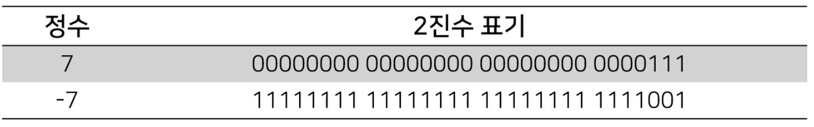

- < 0이 아닌 마지막 비트를 찾는 방법 >
  - 특정한 숫자 K의 0이 아닌 마지막 비트를 찾기 위해서 K & -K를 계산하면 됨 (위의 경우 1)

- K & -K 계산 결과 예시 (표)

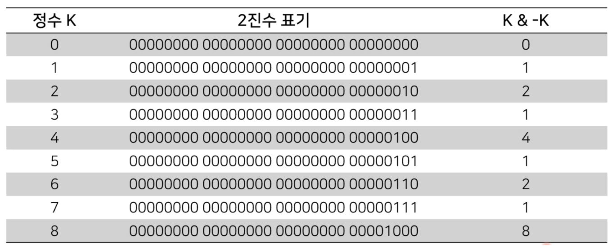


- K & -K 계산 결과 예시 (파이썬)

> 4_1

```python
n = 8 

for i in range(n+1) :
  print(f'{i}의 마지막 비트: {i & -i}')
  
# 결과
0의 마지막 비트: 0
1의 마지막 비트: 1
2의 마지막 비트: 2
3의 마지막 비트: 1
4의 마지막 비트: 4
5의 마지막 비트: 1
6의 마지막 비트: 2
7의 마지막 비트: 1
8의 마지막 비트: 8
```


### 1. 트리 구조 만들기

- 0이 아닌 마지막 비트 = 내가 저장하고 있는 값들의 개수

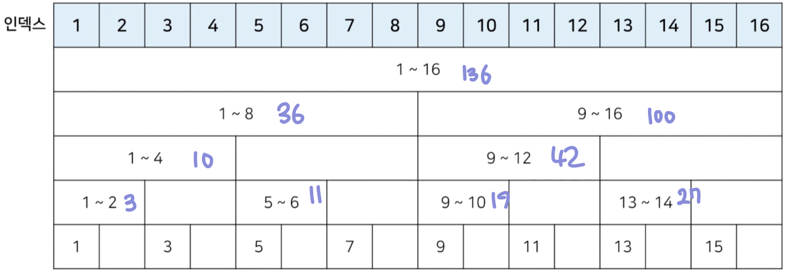


### 2. 값 업데이트

- 특정 값을 변경할 때 : 0이 아닌 마지막 비트만큼 더하면서 구간들의 값을 변경 (예시 = `3rd`)

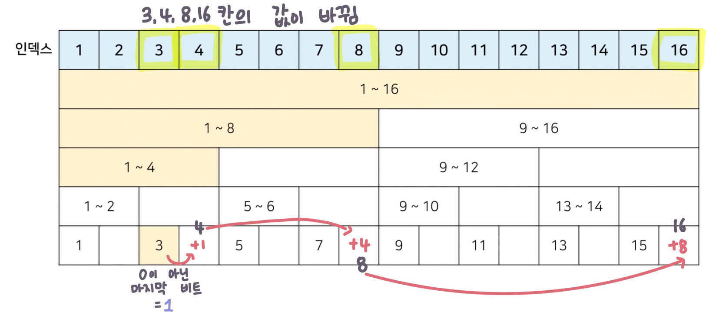

### 3. 누적 합 (Prefix Sum)

- **1부터 N까지의 합(누적 합) 구하기** : 0이 아닌 마지막 비트만큼 빼면서 구간들의 값의 합 계산 (예시 = `11th`)

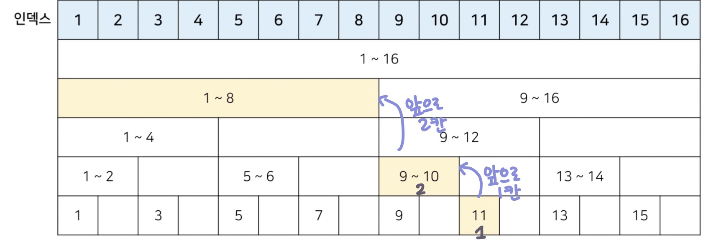


### 4. 바이너리 인덱스 트리 구현 (파이썬)

> 4_2

```python
import sys
input = sys.stdin.readline()

# 데이터의 개수(n), 변경 횟수(m), 구간 합 계산 횟수(k)
n, m, k = map(int,input().split())

# 전체 데이터의 개수는 최대 1,000,000개
arr = [0] * (n+1)
tree = [0] * (n+1)

# i번째 수까지의 누적합을 계산하는 함수
def prefix_sum(i):
    result = 0
    while i>0:
        result += tree[i]
        # 0이 아닌 마지막 비트만큼 빼가면서 이동
        i -= (i & -i)
    return result

# i번째 수를 바뀐 크기(dif)만큼 더하는 함수
def update(i,dif):
    while i <= n:
        tree[i] += dif
        i += (i & -i)

# start부터 end까지의 구간 합을 계산하는 함수
def interval_sum(start,end):
    return prefix_sum(end) - prefix_sum(start - 1)


for i in range(1,n+1): # 1부터 데이터의 갯수만큼
    x = int(input())
    arr[i] = x
    update(i,x)

for i in range(m+k): # 변경 횟수(m) + 구간 합 계산 횟수(k)
    a, b, c = map(int,input().split())

    # 1. 업데이트(update) 연산인 경우
    if a == 1:
        update(b,c-arr[b]) # 바뀐 크기(dif)만큼 적용
        arr[b] = c

    # 2. 구간 합(interval sum) 연산인 경우
    else :
        print(interval_sum(b,c))
        
# 입력
5 2 2
1
2
3
4
5
1 3 6
2 2 5
1 5 2
2 3 5

# 출력
17
12
```


# -------------------------------------------------------------------

# 5장) 선택 정렬과 삽입 정렬

- **정렬** : 데이터를 특정한 기준에 따라 순서대로 나열하는 것 (일반적으로 문제 상황에 따라서 적절한 정렬 알고리즘 사용)


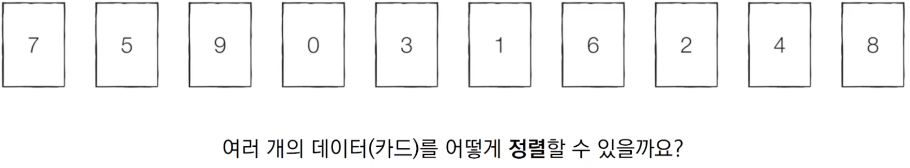


## 1. 선택 정렬

- 처리되지 않은 데이터 중에서 **가장 작은 데이터를 `선택`해 맨 앞에 있는 데이터와 바꾸는 것을 반복**

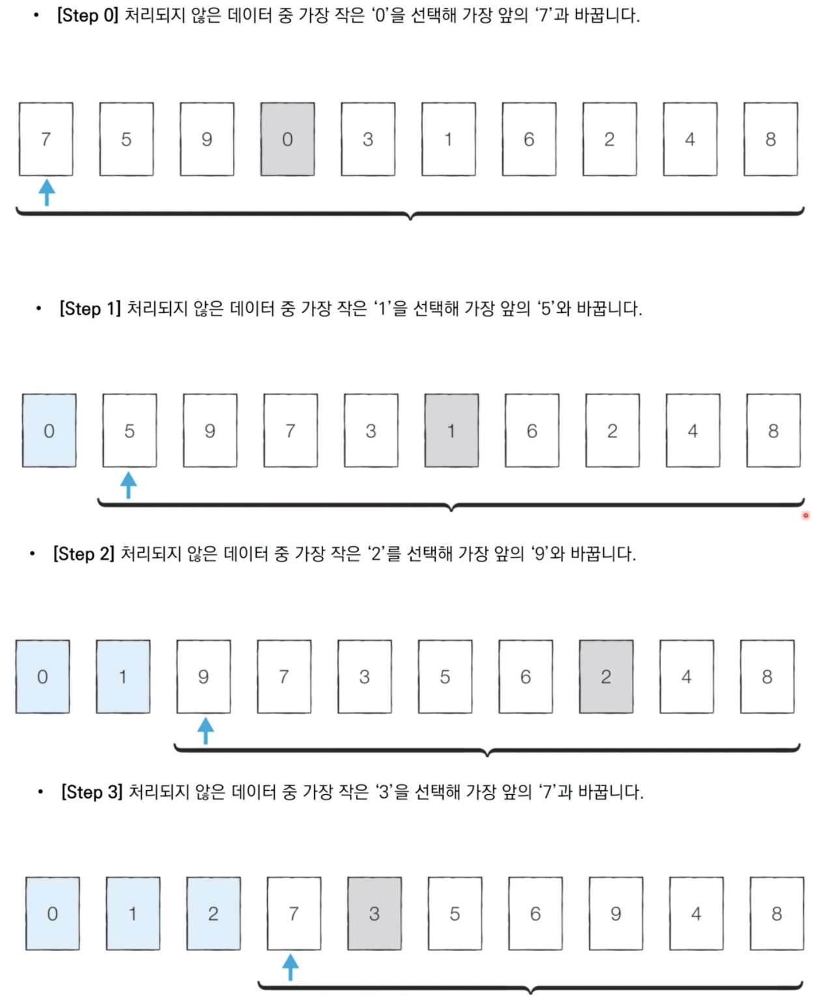

### 1-2. 선택 정렬 구현 (파이썬)

> 5_1

```python
array = [7,5,9,0,3,1,6,2,4,8]

for i in range(len(array)):
    min_index = i # 가장 작은 원소의 인덱스
    for j in range(i+1, len(array)):
        if array[min_index] > array[j]:
            min_index = j
    array[i],array[min_index] = array[min_index],array[i]

print(array)

# 출력
[0,1,2,3,4,5,6,7,8,9]
```


### 1-3. 선택 정렬의 시간 복잡도

- 선택 정렬의 N번 만큼 가장 작은 수를 찾아서 맨 앞으로 보내야 함

- 구현 방식에 따라서 사소한 오차는 있을 수 있지만, 전체 연산 횟수는 다음과 같음

  ```pyth
  N + (N - 1) + (N - 2) + ... + 2
  ```

- 이는 (N² + N - 2)로 표현 가능, Big O 표기법에 따라서 **O(N²)**


## 2. 삽입 정렬

- 처리되지 않은 데이터를 하나씩 골라 적절한 위치에 삽입
- 선택 정렬에 비해 구현 난이도가 높은 편이지만, 효율적으로 동작

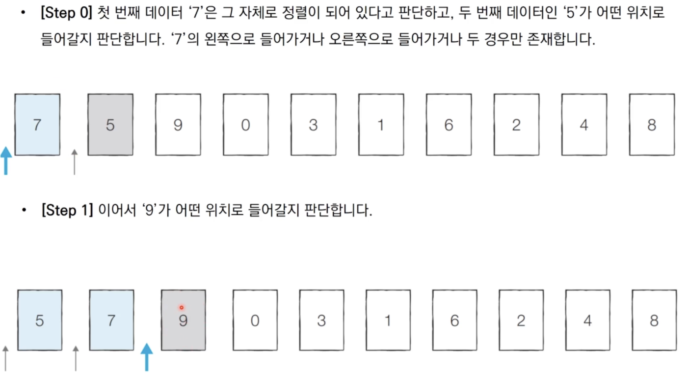


### 2-1. 삽입 정렬 구현 (파이썬)

> 5_2

```python
array = [7,5,9,0,3,1,6,2,4,8]

for i in range(1,len(array)):
    for j in range(i, 0, -1):
        if array[j] < array[j-1]: # 왼쪽 칸이 작으면 왼쪽으로 한 칸 이동
            array[j],array[j-1] = array[j-1],array[j]
        else :
            break

print(array)
```


### 2-2. 삽입 정렬 시간 복잡도

- **O(N²)**, 선택 정렬과 마찬가지로 반복문이 두 번 중첩되어 사용
- 삽입 정렬의 현재 **리스트의 데이터가 거의 정렬되어 있는 상태**라면 매우 빠르게 동작
  - 최선의 경우 **O(N)**
  - 이미 정렬되어 있는 상태에서 다시 삽입 정렬을 수행할 시 **O(N)**
